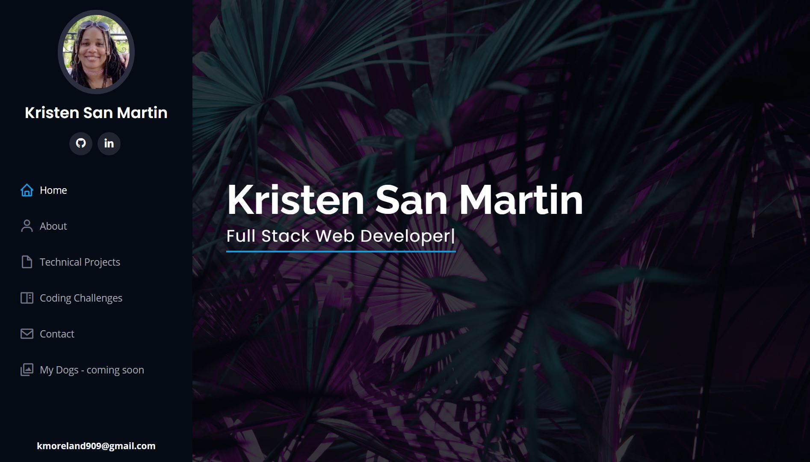
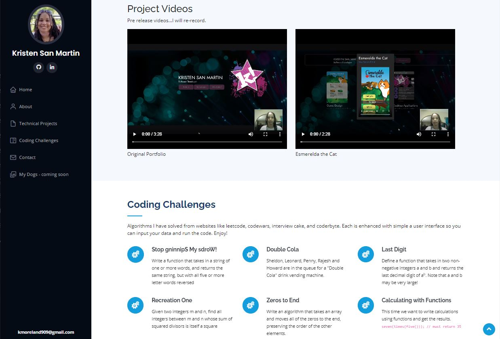
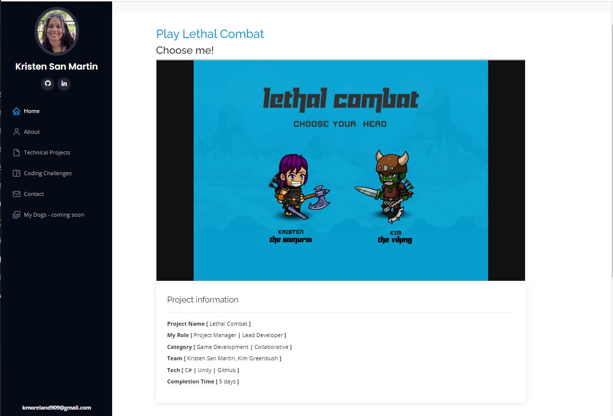
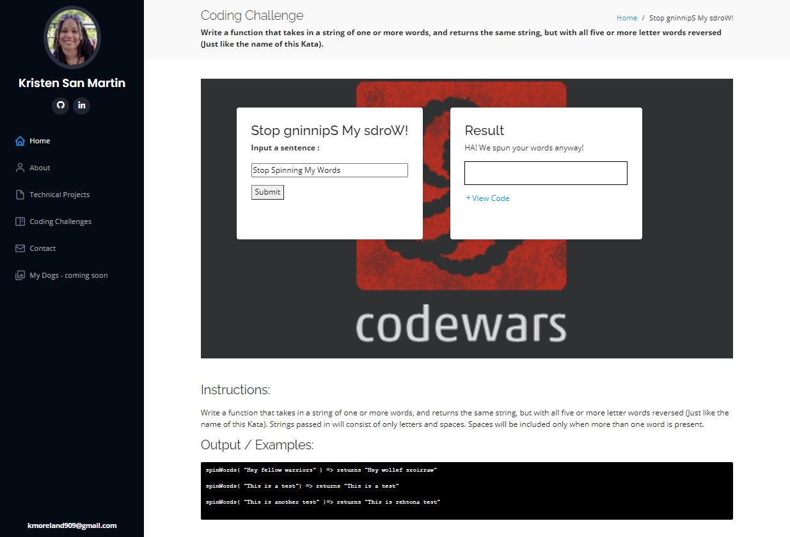

# KISMET-INC.github
## **kis·met**  
    /ˈkizmit,ˈkizˌmet/  
*noun*  
```bash
destiny; fate.
```

>  “The only person you are destined to become is the person you decide to be.”  
**― Ralph Waldo Emerson**


## Description
I chose **KISMET** not just for it's meaning but also as a meaningful shorthand to my name **KRISTEN SM**

**[KISMET-INC.github.io](https://kismet-inc.github.io/index.html)** is a website to display my body of work as a software developer in a clean professional manner. It was launched from a Bootstrap template in order to be ready to view in a timely manner post graduation. While this website model is entirely HTML, and CSS in was generated using several other technologies such as **[Gulp.js](https://gulpjs.com/)**, **[NodeJS](https://nodejs.org/en/)**, and **[Nunjucks](https://mozilla.github.io/nunjucks/)**. The backbone of this repository and the code I workded with directly is located at **[KISMET-INC/portfolio-dev](https://github.com/KISMET-INC/portfolio-dev)**.

## Screenshots






## Installation

1. Clone the repository down to your local drive by opening up a terminal in the folder of your choice and type the code: 
```bash
git clone https://github.com/KISMET-INC/KISMET-INC.github.io.git
```
2. Double click the **index.html** to launch the website locally

## Contributing
I am not accepting contributions to this project at this time.

## Roadmap
As I get better and upgrade my projects or add new ones this website will be constantly updated to reflect that. Bookmark the deployment url for this site, **[KISMET-INC.github.io](https://kismet-inc.github.io/index.html)** to see what I add to it in the future.

## Authors and acknowledgment
Thank you to [BootStrapMade](https://bootstrapmade.com/) for supplying an easy to use template to launch and learn from.

